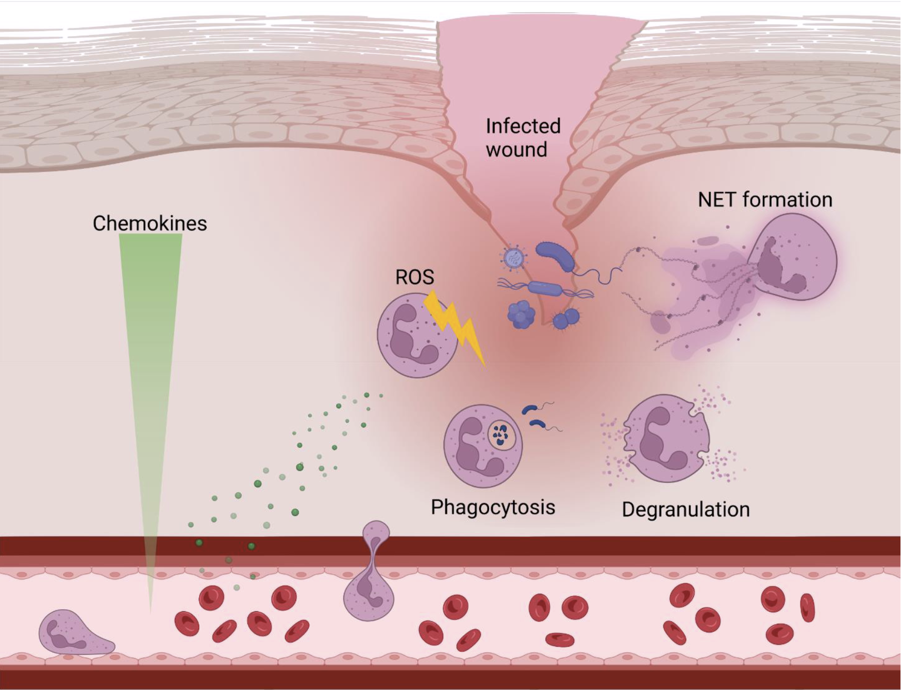
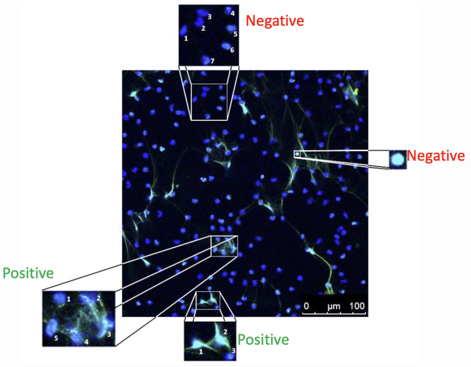
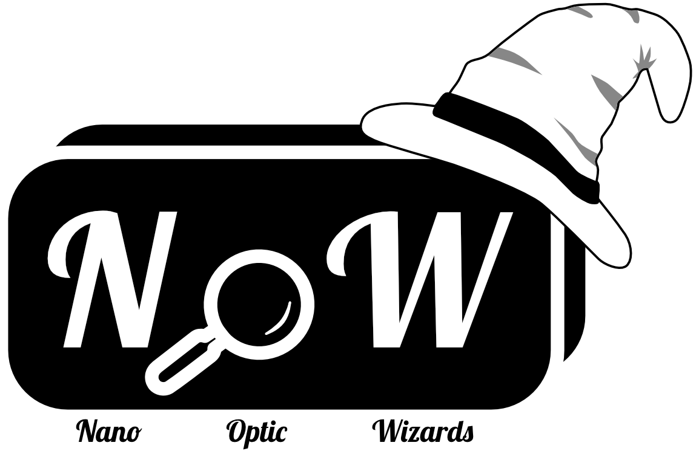
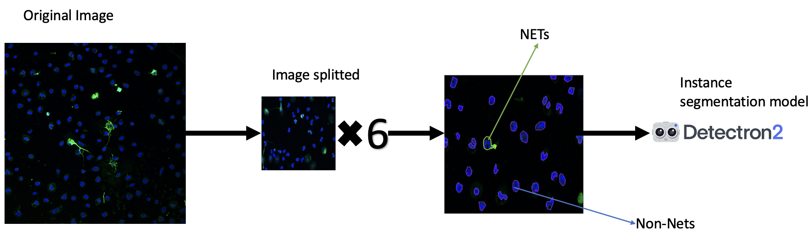
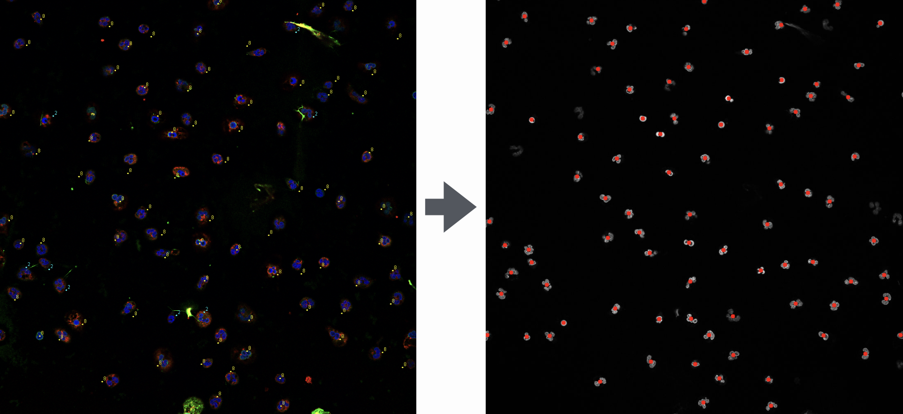
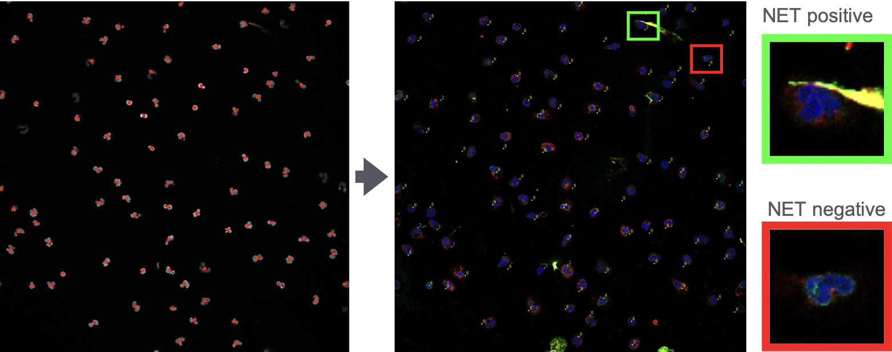

# Automated Recognition and Quantification of NETs

This is our capstone project for the Data Science workshop at neuefische. We had four weeks during which we were working completely autonomous on a machine learning-related project of our own choice. The team working on this project is composed as shown below:

|Name|Background|
|---|---|
|Dipali Kale|Chemistry|
|Rabiat Ibrahim|Energy Engineering & Data Science|
|Niharika Garg|Natural Sciences|
|Dominik van Bodegraven|Biology & Virology|

For our project we got in contact with the Institute of Biochemistry of the Veterinary Medical School Hanover. 


They are investigating neutrophil extracellular traps (NETs). Neutrophils are part of the innate immun system. They have various mechanisms to help the body protect itself against pathogens. This can happen via generation of reactive oxigen species (ROS), phagocytosis, degranulation or NETosis.



NETosis is a version of programmed cell death where the nucleus of the neutrophil starts decondensating and the DNA is externalized into the extracellular space. The thereby formed NETs have a DNA backbone and are decorated with antimicrobial proteins. Since NETs are relevant for human health they are an important research target. We aim to help Scientists working in this field by developing a tool for easy, quick and reliable quantification of NETs.

Researchers in the NET-field will often face the situation that they have to identify NETs in immunofluorescent (IF) microscopy images.



In blue you can see the nuclei of the neutrophils. Depicted in green you can observe DNA histone-1-complexes, which decorate the NETs. If we want to define criteria to identify a NET-positive cell, we need to look at networks (bottom left) or off-shoots (bottom right) of green color. On top of that, the nuclei themselves are enlarged and decondensated (bottom left) compared to those of NET-negative cells (top).

Different groups of reseachers aimed to (semi)automatize the quantification of NETs with object shape detection tools, [but no attempt delivered a reliable quantification tool](https://www.cell.com/heliyon/fulltext/S2405-8440(23)04189-0?_returnURL=https%3A%2F%2Flinkinghub.elsevier.com%2Fretrieve%2Fpii%2FS2405844023041890%3Fshowall%3Dtrue). Thus, we formed the Nano Optic Wizards (NOW) and aimed to develop a machine learning-based tool for NET quantification.



## Modelling strategies

After trying out different approaches to the problem, we followed two different strategies.

1. Rabiat & Dipali: Use computer vision tools (Detectron or CNN built on pretrained models like VGG16, yolo and UNET) to detect the shapes of NET positive/negative cells in whole IF images. Since the images were often very convoluted, we first Split the images into six smaller images. For training each cell was manually labelled as NET positive/negative.



2. Niharika & Dominik: Subimaging classification. First find the center coordinates of each nucleus (use only the blue channel for this). Then use these coordinates to generate 60 x 60 pixel subimages from the two/three-channel images. These subimages are manually labelled as NET positive/negative and used for classification. We first tried several ANN approaches, but they were always overfitting a lot. The best result was achieved, when the subimages were greyscale converted and used for a simple logistic regression.


Finding the center coordinates of the nuclei in the blue channel.


Using these coordinates to generate 60 x 60 pixel subimages of each cell. Use them to they a classification model.

## Important files

The important files to look for in this repository are:
- in the folder __subimaging__ you will find different notebooks that led to the construction of the subimaging pipeline:
    - __nucleus_detection.ipynb__: This is the pipeline that was created to detect nuclei in the blue channel of the images and use the coordinates to generate 60 x 60 subimages. This pipeline generated the subimages that were used to train the classification models.
    - in the subfolder __modelling__ you will find all our different modelling approaches. In order to use computer power efficiently, we did most of the modelling on google colab. The notebooks in that folder are downloaded from there to be displayed here. The best model that we used in the end is found in __modeling_pipeline_DOP.ipynb__.
    - __application.ipynb__: This notebook automatically splits the blue channel off from a three-color image. It then uses the nucleus detection pipeline to generate the subimages and directly uses them for prediction with the best machine learning model. It then automatically exports all the information the user would need about the classification of the subimages as well as as overview csv file for the whole images, where the counts of NET positive and negative cells are quantified and a NET positive ration is calculated.
- in folder __computer_vision_models__ you find our attempts to use CNN or detectron to detect and quantify NETs (not polished, yet)
- in the folder __presentation__ > __Final_Presentation__ you will find a PDF of our final presentation (__NOW_Final presentation.pdf__)
- in the folder __Streamlit_NET_app__ you find all documents that we wrote to design our web application (not polished, yet)

# Set up your Environment

If you want to execute some of the commands, please set up your environment as adviced below.

### **`macOS`** type the following commands : 

- Install the virtual environment and the required packages by following commands:

    ```BASH
    pyenv local 3.11.3
    python -m venv .venv
    source .venv/bin/activate
    pip install --upgrade pip
    pip install -r requirements.txt
    ```
    
### **`WindowsOS`** type the following commands :

- Install the virtual environment and the required packages by following commands.

   For `PowerShell` CLI :

    ```PowerShell
    pyenv local 3.11.3
    python -m venv .venv
    .venv\Scripts\Activate.ps1
    pip install --upgrade pip
    pip install -r requirements.txt
    ```

    For `Git-bash` CLI :
  
    ```BASH
    pyenv local 3.11.3
    python -m venv .venv
    source .venv/Scripts/activate
    pip install --upgrade pip
    pip install -r requirements.txt
    ```

    **`Note:`**
    If you encounter an error when trying to run `pip install --upgrade pip`, try using the following command:
    ```Bash
    python.exe -m pip install --upgrade pip
    ```
